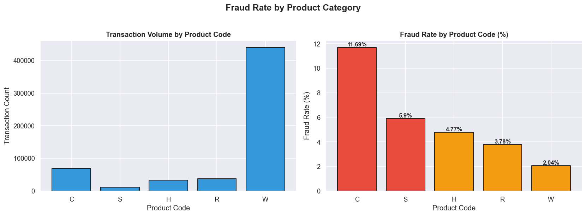
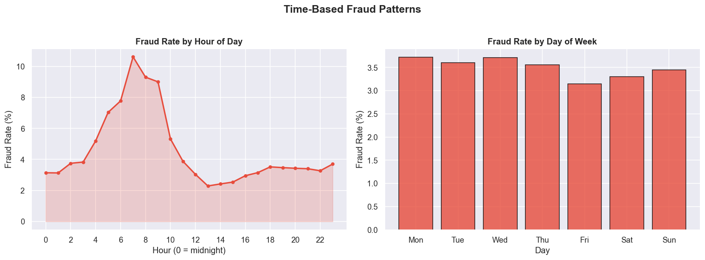
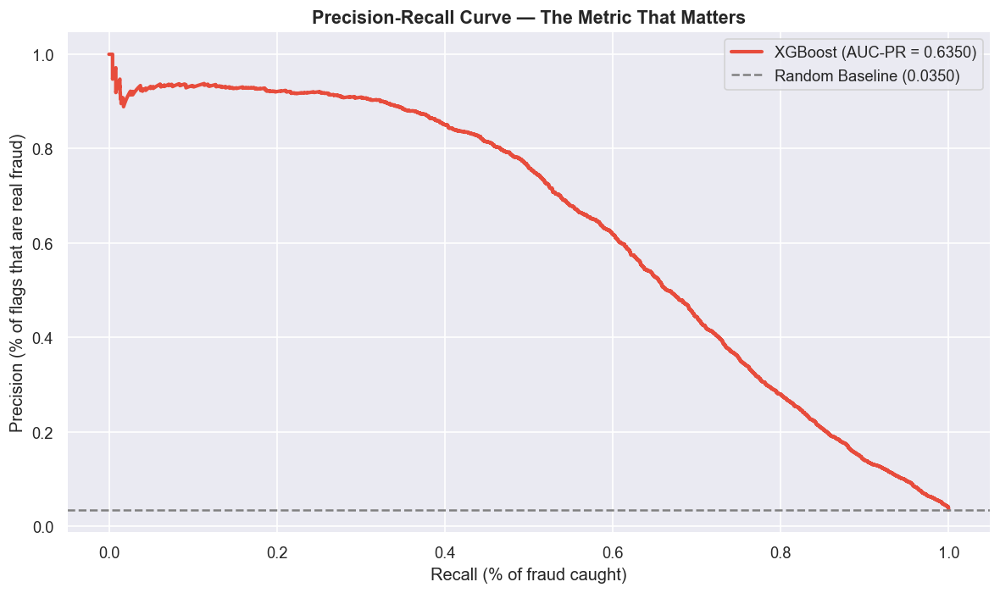
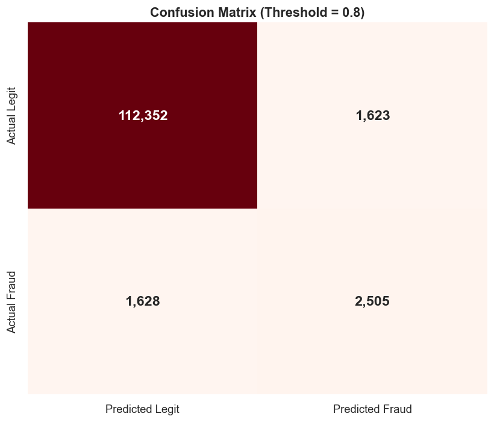
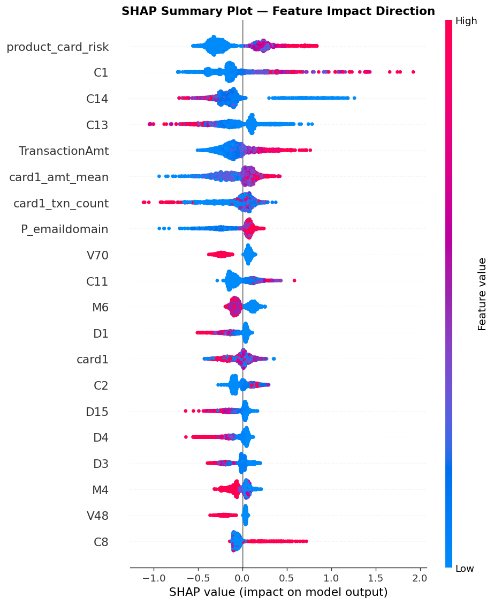
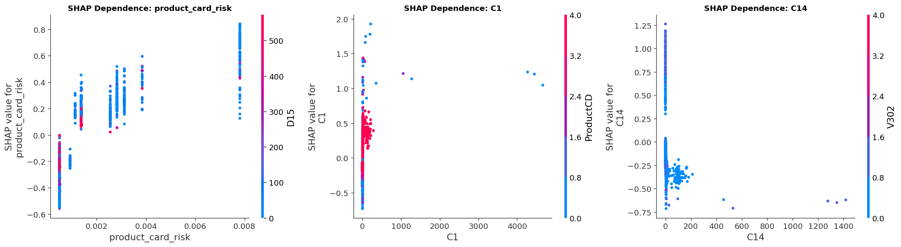
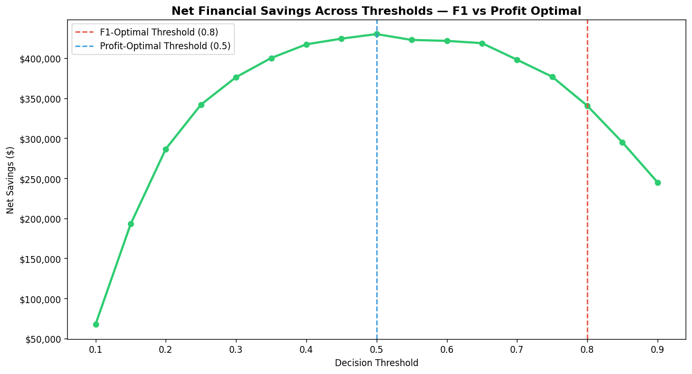
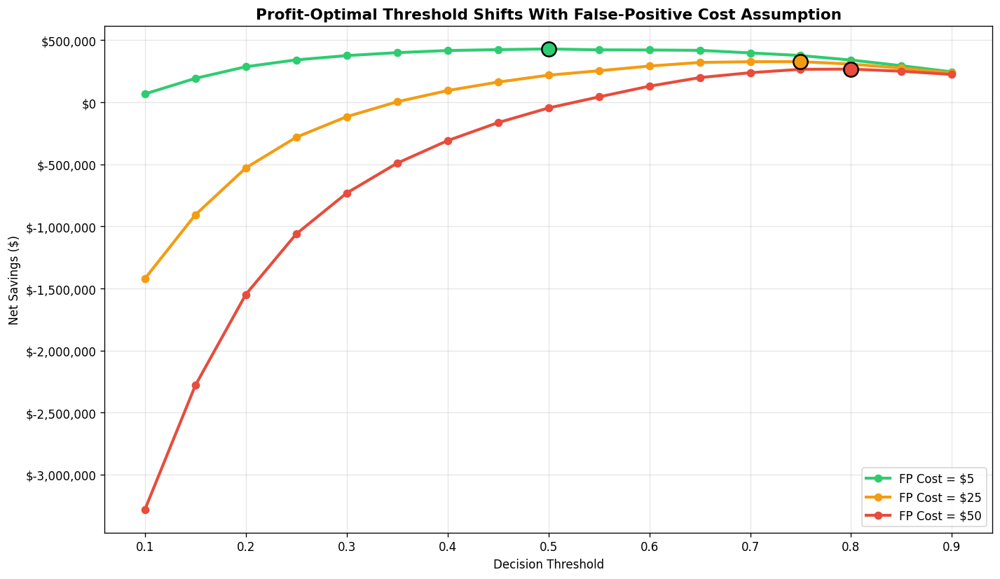

# Credit Card Fraud Detection & Business Impact System

End-to-end fraud detection pipeline built on the IEEE-CIS Fraud Detection dataset (590K+ transactions), going beyond model accuracy to quantify net financial impact and threshold trade-offs in dollar terms.

---

## TL;DR for Recruiters

- Built an XGBoost fraud classifier on 590,540 transactions (3.5% fraud rate) achieving **0.94 AUC-ROC / 0.635 AUC-PR**
- Diagnosed and fixed **target leakage** in risk-encoded features before final modeling
- Used **SHAP** to validate that only 3 of 22 engineered features added real predictive value beyond raw data — and reported that honestly instead of overstating feature engineering effort
- Translated model output into a **net savings framework** ($267K–$430K on the test set depending on cost assumptions) instead of stopping at AUC
- Ran a **cost-sensitivity analysis** showing the optimal decision threshold shifts from 0.50 to 0.80 as false-positive cost rises from $5 to $50 — proving threshold choice is a business decision, not a fixed ML output

---

## Business Problem

Financial institutions lose billions annually to transaction fraud. The challenge isn't just detecting fraud — it's doing so while minimizing false positives, since every wrongly blocked legitimate transaction carries a real cost in customer friction, support load, and churn risk. A model optimized purely for accuracy or AUC can look excellent on paper while making poor business decisions. This project treats threshold selection and feature value as economic questions, not just modeling questions.

---

## Dataset

**IEEE-CIS Fraud Detection** (Kaggle): 590,540 transactions across two joined tables (transaction + identity), 434 raw features, 3.50% fraud rate, $79.7M total transaction volume.

[https://www.kaggle.com/c/ieee-fraud-detection/data](https://www.kaggle.com/c/ieee-fraud-detection/data)

---

## Project Structure

```
fraud-detection/
├── data/
│   ├── raw/                  # Original Kaggle files
│   └── processed/            # Cleaned, engineered, split data
├── notebooks/
│   ├── 01_data_understanding.ipynb
│   ├── 02_eda.ipynb
│   ├── 03_preprocessing.ipynb
│   ├── 04_feature_engineering.ipynb
│   ├── 05_modeling.ipynb
│   ├── 06_evaluation.ipynb
│   ├── 07_shap_explainability.ipynb
│   ├── 08_business_impact.ipynb
│   └── 08b_cost_sensitivity.ipynb
├── models/                   # Saved XGBoost + baseline models
├── reports/                  # All plots, CSVs, JSON summaries
├── requirements.txt
├── Fraud_Detection_Case_Study.pdf
└── README.md
```

This project is fully notebook-based by design. Each notebook is self-contained and runs sequentially — 01 through 08b — with each one saving the outputs the next one depends on.

---

## Pipeline Summary

### 1. Data Understanding

Merged transaction and identity tables on `TransactionID`. Confirmed severe class imbalance (3.50% fraud) and identified 414 columns with missing values, ranging up to 99% missing in identity fields.

### 2. Exploratory Data Analysis

Surfaced four actionable patterns directly used in modeling:
- **ProductCD 'C'** carries an 11.69% fraud rate, 3x the overall average
- **Discover cards** show 7.73% fraud vs 2.87–3.48% for other networks
- **Credit cards** carry 6.68% fraud vs 2.43% for debit
- Fraud peaks sharply between **6 AM–9 AM**, not late night as commonly assumed

<p align="center">
  
</p>

<p align="center">
  
</p>

### 3. Preprocessing

Dropped 208 columns exceeding 70% missing data. Imputed count features (`C*`) with zero (domain logic: absence means zero count), time-delta and Vesta features (`D*`, `V*`) with median (outlier-robust). Filled missing categorical values with `'unknown'` rather than mode, since missingness in identity fields is itself a fraud signal. Applied frequency encoding to high-cardinality categoricals and label encoding to low-cardinality ones. Removed 25 near-zero-variance columns. Final shape: 590,540 × 204.

### 4. Feature Engineering

Built 22 features across five categories: time-based (peak fraud hour flags), amount-based (log transform, percentile buckets), risk-encoded categoricals (product/card risk scores), card velocity (transaction count and amount deviation per card), and interaction terms.

**Critical fix:** the initial risk-encoded features were computed on the full dataset, leaking test-set fraud labels into training features. This was identified and corrected by recomputing all risk scores using smoothed target encoding fit only on the training fold.

### 5. Modeling

Established a Logistic Regression baseline (Test AUC 0.8477) before XGBoost (Test AUC 0.9399, AUC-PR 0.635), using `scale_pos_weight` to handle the 27.6:1 class imbalance natively rather than synthetic oversampling. Train-test AUC gap of 0.018 confirmed no meaningful overfitting.

### 6. Evaluation

AUC-ROC is misleading on this data — it stays high even for weak performance on the rare class. AUC-PR (0.635) is the honest metric. At the F1-optimal threshold (0.80): 60.7% precision, 60.6% recall, with 2,505 fraud cases correctly caught and 1,628 missed.

<p align="center">
  
  
</p>

### 7. Explainability (SHAP)

Validated feature importance with SHAP rather than trusting XGBoost's built-in importances alone. **Finding: only 3 of 22 engineered features (`product_card_risk`, `card1_amt_mean`, `card1_txn_count`) ranked in the top 20 by SHAP value.** All time-based features ranked in the bottom 30%, suggesting their signal was already captured indirectly by raw V/C columns. The top 5 SHAP features overall were `product_card_risk`, `C1`, `C14`, `C13`, and `TransactionAmt` — meaning Vesta's anonymized count features outperformed most custom engineering. This is reported as a finding, not hidden as a failure.

<p align="center">
  
</p>

<p align="center">
  
</p>

### 8. Business Impact Quantification

This is the core differentiator of the project. Rather than stopping at a classification metric, transaction-level dollar amounts were used to compute net savings under explicit, stated cost assumptions (false-positive friction cost, investigation cost per flagged transaction).

| Metric | Value |
|---|---|
| Fraud caught (TP) at threshold 0.80 | $358,987 |
| Fraud missed (FN) at threshold 0.80 | 1,628 cases |
| False positive friction + investigation cost | $18,435 |
| **Net savings at F1-optimal threshold (0.80)** | **$340,552** |
| **Net savings at profit-optimal threshold (0.50)** | **$430,064** |

**Key finding:** the F1-optimal threshold is not the profit-optimal threshold. Optimizing purely for F1 left **$89,512** in unrealized net savings on the table. The profit-optimal threshold depends entirely on the false-positive cost assumption used.

<p align="center">
  
</p>

### Cost-Sensitivity Analysis

The $5 false-positive cost assumption was stress-tested against $25 and $50 scenarios to check robustness:

| FP Cost Assumption | Optimal Threshold | Net Savings | Fraud Caught | False Positives |
|---|---|---|---|---|
| $5 | 0.50 | $430,064 | 3,414 | 10,574 |
| $25 | 0.75 | $327,581 | 2,704 | 2,463 |
| $50 | 0.80 | $267,517 | 2,505 | 1,623 |

The optimal threshold moves monotonically from 0.50 to 0.80 as false-positive cost rises — confirming the threshold-selection framework behaves logically rather than producing a fragile, assumption-dependent fluke. The real-world false-positive cost (customer churn risk, lifetime value loss, support cost) was not measured in this project; it would need to come from actual company data, not be assumed.

<p align="center">
  
</p>

---

## Key Decisions & Why They Matter

| Decision | Reasoning |
|---|---|
| AUC-PR over AUC-ROC as primary metric | ROC-AUC is inflated by the easy 96.5% majority class; PR-AUC reflects real performance on rare fraud cases |
| Fixed target leakage in risk-encoded features | Risk scores were originally computed on the full dataset before the train/test split; corrected with train-only smoothed target encoding |
| Reported that 19/22 engineered features added negligible SHAP value | Validating your own feature engineering matters more than maximizing feature count |
| Modeled false-positive cost explicitly | Most fraud projects ignore the cost of wrongly blocking legitimate customers; this project treats it as a first-class cost |
| Ran cost-sensitivity rather than presenting one number | A single "optimal threshold" claim is fragile; showing how it responds to a 10x assumption range is the more defensible, senior-level answer |
| Labeled all annualized projections as extrapolations | Avoids overstating findings the dataset cannot actually support |
| Kept the project notebook-based | All 9 phases run end-to-end as sequential notebooks; this matches how the project was actually built and tested, rather than introducing a separate script layer that duplicates the same logic |

---

## Limitations (Stated Explicitly)

- Vesta's `V*` and `C*` features are anonymized — their real-world meaning is unknown, limiting interpretability of the top SHAP features
- False-positive cost assumptions ($5/$25/$50) are illustrative, not derived from real company data
- `C1` and `C14` show non-linear, interaction-heavy relationships with fraud risk that weren't fully decomposed — a natural next step would be deeper interaction analysis
- The dataset's exact time span is unspecified; any annualized savings figure depends on an unverified assumption about transaction volume over time

---

## Tech Stack

Python 3.11 · pandas · NumPy · scikit-learn · XGBoost · SHAP · imbalanced-learn · matplotlib · seaborn

---

## How to Run

```bash
git clone https://github.com/Codex610/fraud-detection-business-impact-analytics.git
cd fraud-detection
pip install -r requirements.txt
# Download IEEE-CIS dataset into data/raw/
jupyter notebook notebooks/01_data_understanding.ipynb
```

Run notebooks sequentially, 01 through 08b. Each notebook saves outputs that the next notebook depends on.

---

## Author

**Rajneesh Chauhan** — B.Tech Information Technology, Lucknow Institute of Technology (2026)

[GitHub](https://github.com/Codex610) · [Kaggle](https://www.kaggle.com/rajneesh08032004) · [LeetCode](https://leetcode.com/rajNish_001)
